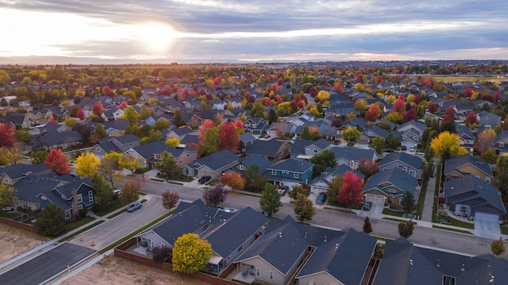
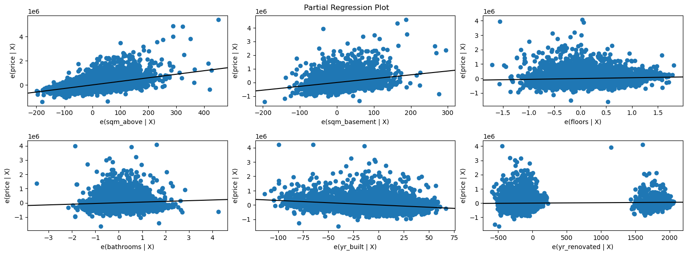

## Analyzing House Sales in a Northwestern County Using Multiple Linear Regression Modeling

Photo by <a href="https://unsplash.com/@jimmy_conover?utm_source=unsplash&utm_medium=referral&utm_content=creditCopyText">Jimmy Conover</a> on <a href="https://unsplash.com/s/photos/neighborhood?utm_source=unsplash&utm_medium=referral&utm_content=creditCopyText">Unsplash</a>

#### Overview

In this project, we will apply statistical analytic methods in this case Multiple Linear Regression Modeling to comprehend the variables affecting home sales in a certain county in the northwest.   

Overall, this analysis aims to advance knowledge and comprehension of the northwest county's housing market by illuminating the variables that have a significant impact on sales and possibly assisting various stakeholders in streamlining their strategies and decision-making procedures.

#### Business Understanding

The primary objective of a real estate company that specializes in helping homeowners buy and sell homes is to offer beneficial services that aid homeowners in maximizing the value of their properties. A significant business problem to address is to be able to advise clients on house modifications and their potential impact on the assessed worth of their homes.

#### Data Understanding

 The dataset contains 21 columns and 21,597 entries (rows).
 The columns in the dataset are as follows:
  - `id`: Unique identifier for each entry (21597 non-null integer values).
  - `date`: Date of the house sale (21597 non-null object values).
  - `price`: Sale price of the house (21597 non-null float values).
  - `bedrooms`: Number of bedrooms in the house (21597 non-null integer values).
  - `bathrooms`: Number of bathrooms in the house (21597 non-null float values).
  - `sqft_living`: Square footage of living space in the home (21597 non-null integer values).
  - `sqft_lot`: Total lot area in square feet (21597 non-null integer values).
  - `floors`: Number of floors in the house (21597 non-null float values).
  - `waterfront`: Indicates if the house has a waterfront view (19221 non-null object values).
  - `view`: Quality of view from house (21534 non-null object values).
  - `condition`: Condition of the house (21597 non-null object values).
  - `grade`: Grade given to the house (21597 non-null object values).
  - `sqft_above`: Square footage of house apart from basement (21597 non-null integer values).
  - `sqft_basement`: Square footage of the basement (21597 non-null object values).
  - `yr_built`: Year the house was built (21597 non-null integer values).
  - `yr_renovated`: Year the house was last renovated (17755 non-null float values).
  - `zipcode`: Zip code of the house location (21597 non-null integer values).
  - `lat`: Latitude of the house location (21597 non-null float values).
  - `long`: Longitude of the house location (21597 non-null float values).
  - `sqft_living15`: Living area of the 15 nearest neighbors in square feet (21597 non-null integer values).
  - `sqft_lot15`: Lot area of the 15 nearest neighbors in square feet (21597 non-null integer values).

 The presence of `non-null` values indicates the number of valid (non-missing) entries in each column. Some columns, such as `waterfront`, `view`, and `yr_renovated`, have missing values denoted by the difference between the non-null count and the total count (21597).

 Here we can see some of the categorical data are in form of strings denoted by object Dtype and the numerical are in form of int64 or float64. But not all int64/float64 Dtype are numerical because we have for instance yr_built which is a categorical Dtype but it is expressed in int64/float64.We can also see that sqft_basement is expressed as strings (categorical variable) instead of numeric which we will fix later on.

 Some of the categorical data we have include:id,date,waterfront,view,condition,grade,yr_built,yr_renovated,zipcode

#### Modeling

In modeling we will be using the Ordinary Least Squares (OLS) method.The general code to achieve it is:

model = sm.OLS(y, sm.add_constant(X))

where the dependent variable (or target variable) is denoted by y, while the independent variable(s) are represented by X .The sm.add_constant() function is used to add a constant term to the independent variable(s) matrix, which is required in OLS regression models to estimate the intercept term.

We can then fit the OLS model to the data using the fit() method ie. 

results = model.fit()

It calculates the coefficients (slope) and intercept that reduce the overall differences or errors between observed and predicted values. and returns the regression results. The results are stored in the results variable.

#### Regression Results

Through the linear regression analysis using the Ordinary Least Squares (OLS) method we built the following model:

price = 6,006,000 + 2934.7sqm_above + 2799.72sqm_basement + 55,510floors + 49,230bathrooms- 3154.97yr_built + 28.64yr_renovated

The above model translates to:

The intercept term is 6,006,000. This represents the estimated price when all the independent variables are zero.

The coefficient for "sqm_above" is 2934.7. It suggests that, on average, for every square meter increase in above ground living area, the price is expected to increase by $2934.7, holding other variables constant.

The coefficient for "sqm_basement" is 2799.72. It indicates that, on average, for every square meter increase in basement area, the price is expected to increase by $2799.72 , holding other variables constant.

The coefficient for "floors" is 55,510. This implies that, on average, each additional floor in the house is associated with an increase of $55,510 in price, assuming other variables remain constant.

The coefficient for "bathrooms" is 49,230. It suggests that, on average, for each additional bathroom in the house, the price is expected to increase by $49,230 , holding other variables constant.

The coefficient for "yr_built" is -3154.97. It indicates that, on average, for every year increase in the age of the house, the price is expected to decrease by $3154.97 , holding other variables constant.

The coefficient for "yr_renovated" is 28.64. It suggests that, on average, for every year increase in the age of the renovation, the price is expected to increase by $28.64 , holding other variables constant.

#### Conclusion

With the above results we can conclude that :

To maximize the estimated value of the property, consider expanding the above ground living space through additions or remodeling.

If your property has a basement or potential for one, renovating or expanding it could positively impact the estimated value of the home.

If feasible and within zoning regulations, consider adding additional floors to the property to potentially increase its value.

If you are considering renovating your house, it's worth keeping in mind that a more recent renovation might contribute to an increased selling price.

